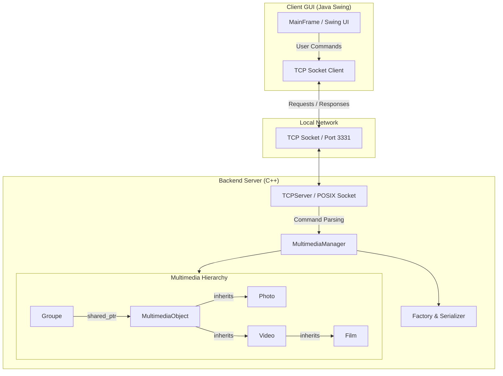

# Distributed Multimedia Center

> C++ multimedia server and Java Swing remote control interface communicating via TCP Sockets.

[](https://isocpp.org/)
[](https://www.oracle.com/java/)
[](LICENSE)

Project developed as part of the **INF224 (Programming Paradigms)** course at **Télécom Paris**.

---

## Table of Contents

- [Description & Features](#description--features)
- [System Architecture](#system-architecture)
- [OOP Concepts & Design Patterns](#oop-concepts--design-patterns)
- [Project Structure](#project-structure)
- [Build and Execution](#build-and-execution)
- [Communication Protocol](#communication-protocol)
- [Author](#author)

---

## Description & Features

This project is a distributed system consisting of a **C++** multimedia management engine and a **Java Swing** graphical client application. Both components communicate over a custom network protocol using TCP Sockets.

### C++ Backend Engine
- **Multimedia Hierarchy**: Object modeling for `Photo` (with GPS coordinates), `Video` (with duration), and `Film` (with chapter duration array).
- **Collection Management**: Grouping media in the `Groupe` class as lists of shared pointers (`std::shared_ptr`), avoiding data duplication in memory.
- **Safe Memory Management**: System-wide use of smart pointers to prevent memory leaks.
- **Multithreaded TCP Server**: Remote request processing (`show`, `play`).
- **Data Persistence**: Catalog serialization and deserialization to disk with dynamic object instantiation (Factory pattern).

### Java Swing Client
- **Graphical User Interface**: Main window featuring a log console, command input field, toolbar, and menu bar.
- **TCP Remote Controller**: Synchronous request delivery to the C++ server and real-time response rendering.

---

## System Architecture



---

## OOP Concepts & Design Patterns

| Concept | Application in Project |
| :--- | :--- |
| **Encapsulation & Abstraction** | Abstract base class `MultimediaObject` enforcing contract methods (`play()`, `className()`). |
| **Smart Pointers** | `std::shared_ptr` to share media objects across multiple groups without duplication. |
| **Factory Pattern** | Dynamic object instantiation from class names during file loading. |
| **Polymorphic Serialization** | Virtual methods `writeData()` / `readData()` for stream persistence. |
| **Sockets & Client-Server** | Clean separation of concerns between GUI and backend business logic via POSIX TCP Sockets. |

---

## Project Structure

```text
Projet-C-Java-Swing/
├── C++/                          # C++ Multimedia Engine
│   ├── main.cpp                  # Local test scenario
│   ├── server.cpp                # TCP Server entry point
│   ├── tcpserver.cpp / .h        # Multithreaded TCP server socket wrapper
│   ├── ccsocket.cpp / .h         # POSIX/BSD socket encapsulation
│   ├── multimediamanager.cpp /.h # Catalog and group manager
│   ├── multimediaobject.cpp /.h  # Abstract base class
│   ├── photo.cpp / .h            # Photo management (lat, long)
│   ├── video.cpp / .h            # Video management (length)
│   ├── film.cpp / .h             # Film management (chapters)
│   ├── groupe.h                  # Media grouping collection
│   └── Makefile                  # C++ build script
│
└── Java-Swing/                   # Java Remote Controller Client
    └── src/
        ├── Main.java             # Client application entry point
        ├── MainFrame.java        # Main window and Swing UI
        ├── Client.java           # Java TCP Socket client
        └── Makefile              # Java build and run script
```

---

## Build and Execution

### 1. Start the C++ Server

```bash
cd C++
make clean && make
./server
```

> By default, the server listens on port **3331**.

---

### 2. Launch the Java Swing Remote Controller

```bash
cd Java-Swing/src
make compile
make run
```

---

## Communication Protocol

Format of text messages exchanged over the TCP socket (port 3331):

```text
Client  --->  "show media franck"   --->  Server
Client  <---  "Photo: franck ..."   <---  Server

Client  --->  "show groupe Contenu" --->  Server
Client  <---  "Groupe: Contenu ..." <---  Server

Client  --->  "play video1"          --->  Server
Client  <---  "Playing video1"       <---  Server
```

---

## Author

**Wassim Smati** — [GitHub](https://github.com/Wassim-Smati)  
Engineering Student at **Télécom Paris**  
Course Project for INF224 (Programming Paradigms).
